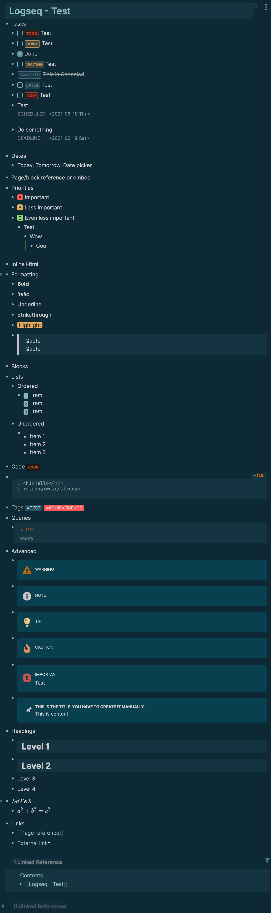

## Logseq - Enhanced Dark Theme

### Theme Features

- An enhanced version of the default Logseq theme (dark mode only)
- Highlight block path (via [colorful indents](https://github.com/cannibalox/logseq-dark-hpx))
- Highlight current block and path
- Easier identifiable headings
- Identify external/page links (via `*` and `^`)
- More beautiful task labels, priorities and tags
- Easier to identify list item numbers

### Thanks

- Based on [logseq dark hpx](https://github.com/cannibalox/logseq-dark-hpx) - thank you, [@cannibalox](https://github.com/cannibalox)
- Thank you [@dracula](https://github.com/dracula/logseq/) for priorities
- Thank you [@pengx17](https://github.com/pengx17/logseq-dev-theme) for inspiration