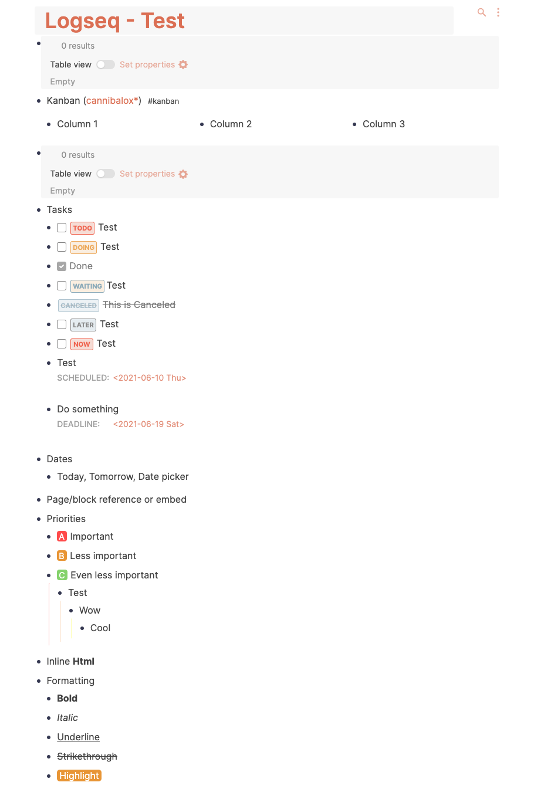

## Logseq - Enhanced Dark & Light Theme

An enhanced version of the default Logseq theme.

### Theme Features

- Highlight current block path (via [colorful indents](https://github.com/cannibalox/logseq-dark-hpx))
- Easier identifiable headings
- Identify external/page links (via `*` and `^`)
- More beautiful task labels, priorities and tags
- Easier to identify list item numbers
- Button highlight on interaction

### Setup

- **Option 1:** Automated updates
  1. Download this repository (clone or as zip file, then extract)
  2. Follow the instructions provided [here](TODO LINK TO MY DOCUMENTATION) to load the `plugin` folder
- **Option 2:** No automated updates, using `custom.css`
  1. Open your `logseq/custom.css` file ([details](https://mschmidtkorth.github.io/logseq-msk-docs/#/page/Custom%20CSS))
  2. Replace its content with the one from [this file](https://github.com/mschmidtkorth/logseq-msk-enhanced/blob/main/custom.css) (copy & paste)

### Thanks

- Based on [logseq dark hpx](https://github.com/cannibalox/logseq-dark-hpx) - thank you, [@cannibalox](https://github.com/cannibalox)
- Thank you [@dracula](https://github.com/dracula/logseq/) for priorities
- Thank you [@pengx17](https://github.com/pengx17/logseq-dev-theme) for inspiration and additional highlighting of block path